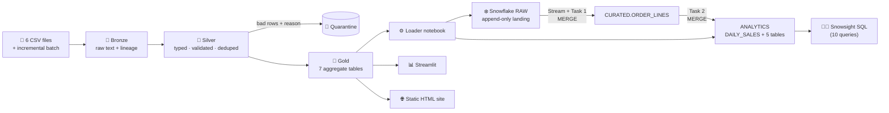

<div align="center">

# 🏗️ Customer Data Analytics using Snowflake & Databricks

### A production-style **medallion pipeline** (Bronze → Silver → Gold) that cleans 100K+ messy e-commerce orders with **PySpark**, quarantines every bad row with a reason, **reconciles revenue to the cent**, and serves it through **Snowflake** and two live dashboards.


[](https://www.python.org/)
[](https://spark.apache.org/)
[](https://www.databricks.com/)
[](https://www.snowflake.com/)
[](https://streamlit.io/)
[](https://duckdb.org/)

[](#-testing--16-automated-checks)
[](#-revenue-reconciliation--the-number-you-can-audit)
[](#-testing--16-automated-checks)
[](#-license)

**[🚀 Live Dashboard](https://YOUR-SITE.netlify.app)** &nbsp;•&nbsp; **[📄 Full Report (PDF)](report/Customer_Data_Analytics_Snowflake_Databricks_Report.pdf)** &nbsp;•&nbsp; **[⚡ Quick Start](#-quick-start-local-no-cloud-account-needed)** &nbsp;•&nbsp; **[🏛️ Architecture](#%EF%B8%8F-architecture)**

</div>

---

## 📑 Table of Contents

<details open>
<summary><b>Click to expand / collapse</b></summary>

1. [At a Glance](#-at-a-glance)
2. [The Problem](#-the-problem)
3. [The Solution](#-the-solution)
4. [Architecture](#%EF%B8%8F-architecture)
5. [Medallion Layers & Gold Tables](#-medallion-layers--gold-tables)
6. [Data Quality Engine](#-data-quality-engine)
7. [Revenue Reconciliation](#-revenue-reconciliation--the-number-you-can-audit)
8. [Testing](#-testing--16-automated-checks)
9. [Performance](#-performance)
10. [Snowflake Layer: Streams, Tasks & RBAC](#-snowflake-layer-streams-tasks--rbac)
11. [Dashboards & Visual Results](#-dashboards--visual-results)
12. [Tech Stack](#%EF%B8%8F-tech-stack)
13. [Quick Start (Local)](#-quick-start-local-no-cloud-account-needed)
14. [Run on Databricks + Snowflake](#%EF%B8%8F-run-on-databricks--snowflake)
15. [Repository Layout](#-repository-layout)
16. [Engineering Challenges & Fixes](#-engineering-challenges--fixes)
17. [Verification Status (Honest Scope)](#-verification-status-honest-scope)
18. [Roadmap](#-roadmap)
19. [Author](#-author) · [License](#-license)

</details>

---

## ⚡ At a Glance

| 🎯 What it is | 📊 Scale | ✅ Proof |
|---|---|---|
| End-to-end **medallion lakehouse pipeline** with a warehouse serving layer | **102,140** order rows · **117,963** order items · **100,600** customers | **16 / 16** automated tests pass |
| Explicit, testable **data-quality rules** with a **quarantine** table | **9,445** bad rows quarantined, each with a reason code | **12 / 12** injected problem types caught in the **exact** injected count |
| Full **and** incremental (MERGE/upsert) loads | **7 Gold tables**, **2 dashboards**, **5 Databricks notebooks**, **5 Snowflake scripts** | **3 full + 2 incremental runs** → identical row counts (idempotent) |
| Runs on a **1 CPU core / 4 GB RAM** laptop-class machine | Full load in **105–127 s** · incremental in **73–77 s** | Revenue reconciles **source → Gold with R$ 0.00 difference** |

> 💡 **Why this project stands out:** most pipeline projects prove that *the code ran*. This one proves that *the numbers are right*: an independent pandas re-implementation recalculates revenue from the raw CSVs and must match Gold exactly, and every injected data defect must land in quarantine in its exact count.

---

## 🧩 The Problem

A retail analytics team selling through an online marketplace needs to answer **three questions every week**:

1. 💰 **How much did we sell?**
2. 🚚 **Which categories and states are underperforming on delivery?**
3. 👥 **Which customers are worth retaining?**

But the raw data arrives as **six flat files per batch** (orders, order items, customers, products, payments, reviews) and is **not fit to query directly**:

- 🔁 Order IDs **repeat** when a status update resends a row
- 💥 Roughly **1 in 68 order rows** has a broken key or an impossible date
- 🔤 Text fields like `state` and `payment_type` are **inconsistently cased** across batches

**Two named users, two needs:**

| Persona | Need |
|---|---|
| 📈 **Retail Operations Analyst** | Daily revenue and delivery-delay numbers **without writing PySpark** |
| 🛠️ **Data Engineer** | The same numbers must **reconcile exactly to the source files** when a stakeholder asks *"where did this number come from?"* |

Both currently rely on ad-hoc spreadsheet pulls that **cannot be reproduced or audited**.

---

## 💡 The Solution

Databricks notebooks read raw CSVs into **Bronze** exactly as received, apply typed and validated rules to produce **Silver**, and aggregate Silver into **seven Gold tables**. A loader pushes Gold to **Snowflake**, where a **stream + two chained tasks** keep a curated order-line table and a daily-revenue table refreshed automatically. A **Streamlit app** and a **single-file static HTML dashboard** read the same Gold tables, so the numbers never disagree.

### ✨ Key Features

| | Feature | Detail |
|---|---|---|
| 🥉 | **Bronze = raw + lineage** | Every column kept as text plus `_source_file`, `_row_id` (content hash), `_batch_id`, `_ingested_at`. Exact duplicates detected without a DB sequence |
| 🥈 | **Silver = validated, never silently dropped** | Typed, trimmed, standardised casing, de-duplicated on business key, orphans removed. **Every failed row goes to one quarantine table with a reason code and the raw record as JSON** |
| 🥇 | **Gold = business-ready** | 7 tables, each with a stated grain and a business question it answers |
| ❄️ | **Snowflake serving layer** | Stream + 2 chained tasks (MERGE into `CURATED`, then into `ANALYTICS.DAILY_SALES`) → 5-minute incremental refresh with no full reload |
| 🔐 | **Role-based security, proven** | `ANALYST_ROLE` can read `CURATED` + `ANALYTICS` but **cannot** modify a table, resize the warehouse, or see `RAW.QUARANTINE`. Verified by **8 negative tests** |
| 🔁 | **Idempotent by design** | Re-running full loads 3× and incremental 2× yields identical results |
| 🧪 | **Independent verification** | Revenue recalculated separately in pandas; 10 Snowflake analysis queries re-run locally in DuckDB |
| 💸 | **Student-budget Snowflake** | X-Small warehouse, 60 s auto-suspend, resource monitor capped at 5 credits |

---

## 🏛️ Architecture

<div align="center">
  
  <br/>
  <i>Figure 1. Source files → Databricks (Bronze / Silver / Gold) → Snowflake (RAW / CURATED / ANALYTICS) → three consumers</i>
</div>

<br/>



> **One-way data flow.** Source → Bronze exactly as received → Silver splits every row into *typed table* **or** *quarantine with a reason* → Gold aggregates Silver → loader pushes to Snowflake.

<details>
<summary><b>🔗 Table relationships (Silver) and how Gold derives from them</b></summary>

<br/>

<div align="center">
  
</div>

`customers 1–N orders 1–N order_items N–1 products` · `orders 1–N payments` · `orders 1–0..N reviews`

</details>

<details>
<summary><b>🛑 Five quality checkpoints (a failure stops the job before the Snowflake load)</b></summary>

<br/>

<div align="center">
  
</div>

| Checkpoint | Asserts | Runs |
|---|---|---|
| **CP1** | Bronze rows = source rows | Local + Databricks |
| **CP2** | Bronze = Silver + Quarantine | Local + Databricks |
| **CP3** | Revenue waterfall: source = Gold + excluded | Local + Databricks |
| **CP4** | Row counts equal in Databricks and Snowflake | Cloud only |
| **CP5** | Snowflake task history state = `SUCCEEDED` | Cloud only |

</details>

---

## 🥇 Medallion Layers & Gold Tables

| Layer | Format | What changes here | Refresh strategy |
|---|---|---|---|
| 🥉 **Bronze** | Delta (cloud) / Parquet (local) | **Nothing**: raw text + lineage columns | Full: overwrite · Incremental: insert only unseen `_row_id` |
| 🥈 **Silver** | Delta / Parquet | Typed, trimmed, standardised casing, de-duplicated, validated, orphans removed | Full: overwrite · Incremental: **MERGE (upsert)** on business key |
| 🥇 **Gold** | Delta / Parquet | Aggregated to the grains below | Always rebuilt in full from Silver (cheap enough to skip MERGE) |

### Gold tables: every one has a stated grain and a business question

| Table | One row per… | Business question it answers |
|---|---|---|
| `daily_sales` | calendar day | How much revenue and how many orders did each day bring? |
| `top_categories` | category × month | Which categories sell best, and does the ranking change month to month? |
| `delivery_performance` | customer state × month | Where are deliveries late, and by how many days? |
| `customer_rfm` | customer (`unique_id`) | Who bought recently, often, and for the most money? |
| `order_status_mix` | order status | What share of orders ends in each status? |
| `payment_type_summary` | payment type | How do customers pay, and with how many installments? |
| `fact_order_lines` | order × order item | The line-level fact table the other six are built from |

**Final Gold sizes:** `fact_order_lines` 113,948 · `daily_sales` 615 · `top_categories` 651 · `delivery_performance` 531 · `customer_rfm` 88,714 · `order_status_mix` 8 · `payment_type_summary` 4

---

## 🛡️ Data Quality Engine

Bad data is **never silently coerced or dropped**. Every rule is explicit, counted, and tested.

**How it works:** every failing row is routed to a single **quarantine table** with a **reason code** and the **raw record as JSON**, so nothing disappears and every discarded rupee is accountable.

### 15 rule checks (full load)

| Table | Rule | Rows failed |
|---|---|---:|
| orders | `order_id` and `customer_id` not null | 160 |
| orders | purchase timestamp can be parsed | 25 |
| orders | delivery date not before purchase date | 1,300 |
| orders | `order_id` is unique | 1,500 |
| order_items | `order_id` and `product_id` not null | 90 |
| order_items | price is positive | 30 |
| order_items | `(order_id, order_item_id)` is unique | 800 |
| order_items | parent order exists in Silver | 1,705 |
| payments | `order_id` not null | 20 |
| payments | payment value is positive | 25 |
| payments | `(order_id, payment_sequential)` is unique | 500 |
| payments | parent order exists in Silver | 1,518 |
| reviews | score between 1 and 5 | 15 |
| reviews | `review_id` is unique | 300 |
| reviews | parent order exists in Silver | 1,457 |

<div align="center">
  
  <br/><i>Quarantined rows by table and reason, matching the injection manifest row for row</i>
</div>

### 🎯 The "answer key" trick

`data/generate_dataset.py` **deliberately injects** duplicates, null keys, unparseable timestamps, delivery-before-purchase dates, negative payments, out-of-range review scores and inconsistent casing, and writes the **exact counts** to `data/injection_manifest.json`. **Test T05 compares the quarantine table against that manifest: 12 of 12 rules match exactly.** The pipeline is graded against a known answer key, not eyeballed.

<details>
<summary><b>🔍 Code: de-duplication that quarantines extras instead of dropping them</b></summary>

```python
def _dedupe(df, keys):
    """Keep one row per business key. Extra copies come back tagged for quarantine."""
    w = Window.partitionBy(*keys).orderBy("_row_id")
    r = df.withColumn("_rn", F.row_number().over(w))
    return (r.filter("_rn = 1").drop("_rn"),
            r.filter("_rn > 1").drop("_rn").withColumn("_reason", F.lit("DUPLICATE_KEY")))
```

The content-hash `_row_id` is a **stable tiebreaker**, so the same copy survives on every run.

</details>

<details>
<summary><b>🔍 Code: surviving Spark 4 ANSI mode on a bad timestamp</b></summary>

```python
def _ts(c):
    # Spark 4 runs with ANSI mode on: plain to_timestamp raises on a bad string
    # instead of returning null, and one bad row would crash the whole job.
    return F.expr(f"try_to_timestamp({c}, 'yyyy-MM-dd HH:mm:ss')")
```

</details>

<details>
<summary><b>🔍 Code: deterministic RFM segmentation</b></summary>

```python
# customer id breaks ties so ntile gives the same 5 buckets on every run
r = F.ntile(5).over(Window.orderBy(F.col("recency_days").desc(), "customer_unique_id"))
m = F.ntile(5).over(Window.orderBy(F.col("monetary").asc(), "customer_unique_id"))
```

`Window.orderBy()` without a tiebreaker can put identical-value customers in different buckets between runs. This one line makes the segmentation reproducible (verified by T11).

</details>

---

## 💰 Revenue Reconciliation: The Number You Can Audit

The data engineer's core question: *"where did this number come from?"* The pipeline answers it with a two-stage waterfall that **balances exactly**:

```text
source files (all item rows)              R$ 14,387,978.80
  - quarantined DUPLICATE_KEY                   92,865.86
  - quarantined INVALID_AMOUNT                  -3,424.64
  - quarantined NULL_KEY                        11,228.89
  - quarantined ORPHAN_ORDER                   202,837.42
  = Silver order_items                      R$ 14,084,471.27
  - cancelled / unavailable orders             167,958.70
  = Gold daily_sales revenue                R$ 13,916,512.57

source = quarantined + silver  : True ✅
silver = gold + excluded       : True ✅
```

<div align="center">
  
</div>

And it is checked **independently**: test **T09** re-implements the rules in **pandas directly on the raw CSVs** and requires **R$ 0.00 difference** from Gold. It is not Spark re-checking itself.

---

## 🧪 Testing: 16 Automated Checks

**16 / 16 pass** on the final run. Four failed on their first attempt; the real bugs and fixes are documented [below](#-engineering-challenges--fixes).

| # | What is verified | Method | Result |
|---|---|---|:---:|
| T01 | Bronze row count equals source files (main + incremental) | CSV line count vs Bronze | ✅ |
| T02 | No null keys in Silver | `isna()` on keys | ✅ |
| T03 | No duplicate business keys in Silver | `duplicated()` | ✅ |
| T04 | No delivery before purchase in Silver | timestamp comparison | ✅ |
| T05 | **Every injected problem caught in the exact injected count** | quarantine vs `injection_manifest.json` (12/12) | ✅ |
| T06 | Text casing standardised (state, status, payment type, category) | regex / set checks | ✅ |
| T07 | No zero or negative price / payment in Silver | amount filter | ✅ |
| T08 | Every Bronze row is in Silver, quarantine, or replaced by an update | `bronze − silver − quarantine` | ✅ *(fixed after 1st run)* |
| T09 | **Gold revenue = independent pandas recalculation** | separate re-implementation on raw CSVs | ✅ *(fixed after 1st run)* |
| T10 | Revenue waterfall balances end to end | Decimal sums logged by pipeline | ✅ |
| T11 | **Idempotency**: identical counts across re-runs | 3 full + 2 incremental runs | ✅ |
| T12 | Incremental MERGE inserts new rows and updates changed ones, no duplicates | Silver before/after | ✅ *(fixed after 1st run)* |
| T13 | `customer_rfm`: one row per customer, sums to Gold revenue | uniqueness + sum | ✅ |
| T14 | `delivery_performance` values in valid ranges | range checks | ✅ |
| T15 | Rule unit test on 6 hand-built rows (incl. the date that crashed run 1) | `clean_orders()` in-memory | ✅ |
| T16 | All 10 Snowflake analysis queries run and return rows | SQL file on Gold via **DuckDB** | ✅ *(fixed after 1st run)* |

<div align="center">
  
</div>

**Incremental proof (T12):** after the incremental batch, **+600 new orders inserted, 40 orders updated from `shipped` → `delivered`, 0 duplicates.**

---

## ⚡ Performance

Measured over **five real executions** on a **1 CPU core / 4 GB RAM** sandbox against a **3-minute target**:

| Run | Mode | Total | Bronze | Silver | Gold | Quality |
|:-:|---|---:|---:|---:|---:|---:|
| 1 | full | 126.5 s | 31.0 | 47.8 | 16.7 | 2.6 |
| 2 | full | 105.5 s | 27.9 | 49.3 | 17.0 | 2.7 |
| 3 | full | 105.2 s | 27.7 | 49.6 | 16.8 | 2.9 |
| 4 | incremental | 76.7 s | 26.5 | 22.1 | 16.8 | 2.6 |
| 5 | incremental | 73.0 s | 27.4 | 17.7 | 16.8 | 2.5 |

- ✅ Every full load: **105–127 s**. Every incremental load: **73–77 s**. Both well inside the 3-minute target.
- 🔍 **Bronze is the slowest stage** because it re-reads and re-hashes every source row. Silver and Gold are each under 20 s on the incremental path.
- ♻️ Row counts identical across all three full loads and both incremental loads.

<div align="center">
  
</div>

---

## ❄️ Snowflake Layer: Streams, Tasks & RBAC

```text
RETAIL_DB
├── RAW
│   ├── ORDER_LINES_LANDING   (append-only, fed by the Databricks loader)
│   └── QUARANTINE            (hidden from ANALYST_ROLE)
├── CURATED
│   └── ORDER_LINES           (one row per order line, kept fresh by Task 1)
└── ANALYTICS
    ├── DAILY_SALES           (recomputed for affected days only, by Task 2)
    └── + 5 summary tables    (replaced directly by the loader)
```

**Incremental refresh chain:** a **stream** on the landing table feeds **Task 1**, which `MERGE`s into `CURATED.ORDER_LINES` (runs every **5 minutes**); a chained **Task 2** then recomputes `ANALYTICS.DAILY_SALES` **for the affected days only**. No full reload, no external scheduler.

### 🔐 Security & cost controls

| Control | Setting |
|---|---|
| Warehouse | `RETAIL_WH`, **X-Small**, **auto-suspend 60 s**, auto-resume, created `INITIALLY_SUSPENDED` |
| Cost guardrail | **Resource monitor**: notify at 80 %, **suspend at 100 %** of a 5-credit quota |
| `ENGINEER_ROLE` | Loads data, owns the stream and tasks |
| `ANALYST_ROLE` | **Read-only** on `CURATED` + `ANALYTICS`. Cannot modify tables, cannot resize the warehouse, **cannot see `RAW.QUARANTINE`** |
| Proof | **8 negative tests** in `snowflake/05_security_tests.sql` |

An analyst with read-only access can answer **all 10 business questions** in `snowflake/04_analysis_queries.sql` **without ever touching Databricks**.

---

## 📊 Dashboards & Visual Results

Two dashboards, **one source of truth**: both read the same Gold tables.

<div align="center">
  
  <br/><i>Static HTML dashboard: one self-contained file, hand-rolled inline SVG, no server, no build step, no external script</i>
</div>

<br/>

<div align="center">
  
  <br/><i>Streamlit dashboard with a month-range filter. Runs on the Gold CSVs, or queries Snowflake directly</i>
</div>

### 📈 Business insights from Gold

<table>
<tr>
<td width="50%"><br/><sub><b>Monthly revenue:</b> steady growth with a Nov 2017 spike (Black Friday effect built into the generator). Sep 2018 is a partial month (7-day incremental batch)</sub></td>
<td width="50%"><br/><sub><b>Top 10 categories:</b> health_beauty, sports_leisure and watches_gifts lead at R$ 1.37–1.41M each</sub></td>
</tr>
<tr>
<td width="50%"><br/><sub><b>Late-delivery rate by state</b> (states with 500+ deliveries)</sub></td>
<td width="50%"><br/><sub><b>Customer segments (RFM):</b> 88,714 customers across 6 segments</sub></td>
</tr>
<tr>
<td width="50%"><br/><sub><b>Order status mix</b> (log scale): 96.45 % of orders are delivered</sub></td>
<td width="50%"><br/><sub><b>Payment types:</b> credit card is 73.4 % of value with ~2.8 average installments</sub></td>
</tr>
</table>

**Headline KPIs (Gold, after both loads):** 💰 **R$ 13.92M** revenue · 🧾 **97,830** orders · 🛒 **R$ 142.25** average order value · 🚚 **8.54 %** late deliveries · 👥 **88,714** customers · 🚫 **9,445** rows quarantined

---

## 🛠️ Tech Stack

| Layer | Technology | Why it was chosen |
|---|---|---|
| Transformation | **Python 3.12 / PySpark 4.x** | The same DataFrame API runs locally and on a Databricks cluster with **no code changes** |
| Storage | **Delta Lake** (Databricks) / **Parquet** (local) | Delta gives ACID `MERGE` and time travel; Parquet is the closest laptop equivalent |
| Warehouse | **Snowflake** | Streams + tasks give incremental refresh **without an external scheduler** |
| Dashboard | **Streamlit + Altair** | Pure-Python UI that deploys from a GitHub repo with no frontend build |
| Static site | **Plain HTML + inline SVG** | Zero build step; deploys to Netlify / Vercel / GitHub Pages as a single file |
| Data generation | **pandas + NumPy** | Vectorised generation of 100K+ realistic, **seeded** rows |
| SQL verification | **DuckDB** | Runs the **exact Snowflake SQL file** against Gold with no Snowflake account |
| Diagrams & charts | **Graphviz + Matplotlib + Pillow** | Diagrams stay text-defined and reproducible from a script |

---

## 🚀 Quick Start (Local, No Cloud Account Needed)

```bash
# 1. clone
git clone https://github.com/Sourav-Grover/customer-analytics-snowflake-databricks.git
cd customer-analytics-snowflake-databricks

# 2. environment
python -m venv venv && source venv/bin/activate      # Windows: venv\Scripts\activate
pip install pyspark pandas numpy pyarrow duckdb

# 3. full load: Bronze -> Silver -> Gold from data/raw
python local_run/run_pipeline_local.py --mode full

# 4. incremental load: upsert data/raw_increment
python local_run/run_pipeline_local.py --mode incremental

# 5. run the 16 automated tests
python tests/test_pipeline.py

# 6. export Gold to CSV, then build the static dashboard (writes site/index.html)
python local_run/export_gold_to_csv.py
python dashboard/build_static_site.py

# 7. launch the Streamlit dashboard
pip install -r dashboard/requirements.txt
streamlit run dashboard/app.py
```

**Results land in `outputs/`:** `run_metrics.json` (last run) · `run_history.json` (every run, used to prove idempotency) · `test_results.json` (last test run).

> 🎲 **Dataset:** synthetic, generated by `data/generate_dataset.py` with a fixed NumPy seed (`42`), so re-running reproduces the same files **byte-for-byte**. It follows the six-table structure of the [Olist Brazilian E-Commerce dataset](https://www.kaggle.com/datasets/olistbr/brazilian-ecommerce) (it is **not** the real Kaggle file), so the pipeline logic transfers directly to the real data. Base load: 100,000 orders (Jan 2017 to Aug 2018) + a 600-order incremental batch (Sep 2018) including 40 orders that flip from `shipped` to `delivered` to exercise the MERGE.

---

## ☁️ Run on Databricks + Snowflake

1. **Upload data:** put `data/raw/*.csv` (and `data/raw_increment/*.csv` for the incremental demo) into a Unity Catalog volume, e.g. `/Volumes/retail/landing/raw`.
2. **Clone the repo** in Databricks Repos so `common/` is importable (each notebook already appends the repo root to `sys.path`).
3. **Snowflake setup:** run `snowflake/01_setup_warehouse_roles.sql` and `02_schemas_tables.sql` as `ACCOUNTADMIN`, then `03_stream_and_task.sql` as `ENGINEER_ROLE`.
4. **Secrets:** create a Databricks secret scope named `snowflake` with `sf_url`, `sf_user`, `sf_password` (see the header of `databricks/04_load_to_snowflake.py`).
5. **Run the 5 notebooks in order** (`01` → `05`): `mode=full` the first time, `mode=incremental` for later batches.
6. **Analyse and verify:** query `snowflake/04_analysis_queries.sql` as `ANALYST_ROLE`, and run `snowflake/05_security_tests.sql` to watch the negative permission tests fail as they should.

| Notebook | Job |
|---|---|
| `01_bronze_ingestion.py` | Raw CSV → Bronze with lineage columns |
| `02_silver_cleaning.py` | Typing, validation, dedupe, quarantine, MERGE upsert |
| `03_gold_aggregates.py` | Build the 7 Gold tables |
| `04_load_to_snowflake.py` | Spark–Snowflake connector load (secrets from scope) |
| `05_data_quality_checks.py` | Assert CP1–CP3; **a failure stops the job before the Snowflake load** |

**Deploy the dashboards:** see [`DEPLOY.md`](DEPLOY.md) for Netlify (drag-and-drop or Git-connected), Vercel, GitHub Pages and Streamlit Community Cloud. Snowflake mode for Streamlit: set `DATA_SOURCE=snowflake` plus the `SNOWFLAKE_*` variables from `.env.example`.

---

## 📂 Repository Layout

```text
customer-analytics-snowflake-databricks/
│
├── common/
│   ├── transforms.py            # ALL Bronze → Silver → Gold PySpark logic (shared by cloud + local)
│   └── quality.py               # quality rule results + revenue reconciliation
├── databricks/                  # 5 notebooks: Delta Lake, MERGE, secret scope
├── snowflake/                   # 5 SQL scripts: warehouse/roles, schemas, stream+task, analysis, security tests
├── local_run/                   # same pipeline on a laptop: plain PySpark + Parquet
├── data/
│   ├── generate_dataset.py      # seeded generator with deliberate defects
│   ├── injection_manifest.json  # the "answer key" for test T05
│   ├── raw/                     # full-load CSVs
│   └── raw_increment/           # incremental-batch CSVs
├── dashboard/                   # Streamlit app + Gold CSV exports + static-site builder
├── site/                        # self-contained static HTML dashboard
├── tests/test_pipeline.py       # 16 tests incl. independent pandas revenue recalculation
├── outputs/                     # run_metrics / run_history / test_results from real executions
├── diagrams/                    # architecture, ER, pipeline-flow (Graphviz + Matplotlib)
├── docs/                        # figures, screenshots, demo script
├── report/                      # full 21-page capstone report (PDF + DOCX + generator)
├── DEPLOY.md · netlify.toml · vercel.json · .env.example
└── README.md
```

---

## 🐛 Engineering Challenges & Fixes

Four real problems hit while building this, documented rather than hidden:

| # | Symptom | Root cause | Fix |
|:-:|---|---|---|
| 1 | **Full run crashed** with `DateTimeException` on `'31/02/2018 10:00'` | **Spark 4 runs in ANSI mode by default**, so `to_timestamp()` raises instead of returning null | Switched to `try_to_timestamp()` / `try_cast()`, so the row hits the validation rule and is **quarantined instead of crashing the job** |
| 2 | **First incremental run silently under-counted 4 tables**: Bronze grew by 640 orders, Silver stayed flat, revenue tests off by ~R$ 85,000 | The "new rows" DataFrame was a **lazy** transformation on the Bronze folder. After that folder was overwritten, Spark re-evaluated the anti-join against the *new* folder, found nothing unseen, and passed an **empty batch** to Silver | **Materialise new rows to a separate Parquet snapshot** (`bronze_new`) *before* touching Bronze, then extend Bronze from that fixed snapshot |
| 3 | Test harness crashed with a **DECIMAL overflow** running the 10 Snowflake queries in DuckDB | DuckDB inferred a narrow `DECIMAL(5,2)` from a Gold column and overflowed on a large `SUM()` | Cast Decimal Gold columns to `DOUBLE` **only inside the test harness**; the SQL file was not changed |
| 4 | Report flow diagram was unreadably wide | Graphviz auto-layout doesn't suit a 5-stage, 5-checkpoint flow at page width | Redrew as a fixed three-row snake layout with hand-placed coordinates |

> 🧠 **Key learning:** null-coercion and type-inference behaviour is **not constant across Spark versions**. Code written for an ANSI-off default can crash outright on Spark 4. And **lazy evaluation against a path that a later step overwrites** produces the worst kind of bug: *silently wrong results* rather than a crash. Materialising to a fixed snapshot before continuing removes that whole bug class. The tests (T08, T09) caught bug #2 precisely because they verify *numbers*, not just *execution*.

---

## ✅ Verification Status (Honest Scope)

| Component | Status |
|---|---|
| Local PySpark pipeline (full + incremental) | ✅ Executed 5×; every number in this README comes from `outputs/` |
| 16 automated tests | ✅ 16 / 16 passing |
| Streamlit + static HTML dashboards | ✅ Built from real Gold output |
| 10 Snowflake analysis queries | ✅ Logic-verified in DuckDB (T16) |
| Databricks notebooks (5) | 📦 Provided; share the same `common/` logic that the local run executes |
| Snowflake DDL, stream, tasks, RBAC scripts | 📦 Provided; cloud execution screenshots are listed in [`screenshots/CAPTURE_GUIDE.md`](screenshots/CAPTURE_GUIDE.md) |

---

## 🔮 Roadmap

- [ ] ⏰ Databricks **Job with a schedule** and email/Slack alert on failure
- [ ] 🔺 Real **Delta Lake `MERGE`** in the local run (currently a MERGE-by-join equivalent)
- [ ] 🔁 Seventh Gold table: **cohort retention** (first-purchase month vs repeat-purchase month)
- [ ] 🔒 **Row-level security** in Snowflake so `ANALYST_ROLE` sees only its assigned region's states
- [ ] 🤖 **GitHub Actions CI** running `tests/test_pipeline.py` on every push

---

## 🎓 What This Project Demonstrates

- **Lakehouse / medallion design** with explicit grain and lineage at every layer
- **Data quality as engineering**: rules, quarantine with reason codes, and an answer-key manifest instead of hope
- **Auditable finance-grade numbers**: a reconciliation waterfall plus an independent recalculation
- **Incremental processing**: MERGE/upsert, stream + task orchestration, idempotency proven across repeated runs
- **Cloud cost and access discipline**: X-Small warehouse, auto-suspend, resource monitor, least-privilege roles with negative tests
- **Honest debugging**: root-causing an ANSI-mode crash and a silent lazy-evaluation bug, then writing them up

---

## 📄 Full Report

A 21-page capstone report covering the problem statement, scope, architecture, implementation, tests, results and challenges is included: **[`report/Customer_Data_Analytics_Snowflake_Databricks_Report.pdf`](report/Customer_Data_Analytics_Snowflake_Databricks_Report.pdf)**. A 2–3 minute demo walkthrough script is in [`docs/DEMO_SCRIPT.md`](docs/DEMO_SCRIPT.md).

---

## 👨‍💻 Author

<div align="center">

**Sourav Grover**

B.Tech Computer Science & Engineering (AI/ML & Full-Stack), **KIIT University, Bhubaneswar** · Batch 2023–2027

[](https://github.com/Sourav-Grover)
[](https://www.linkedin.com/in/souravgroverr)
[](mailto:souravgrover132@gmail.com)

*Capstone Project 2026 · Databricks & Snowflake*

</div>

---

## 📜 License

Released under the **MIT License**. Free to use, modify and adapt. Add a `LICENSE` file to the repo root to make this official.

---

<div align="center">

### ⭐ If this project helped you or impressed you, please give it a star!

**Built with 🧱 PySpark · ❄️ Snowflake · 🔥 Databricks · and a lot of reconciliation.**

</div>
